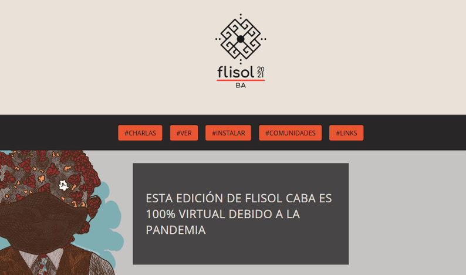

# Flisol 2021
Micrositio estático para difundir el evento Flisol CABA.

[Ver en producción (eventol)](https://ba.flisol.org.ar)

## Sobre Flisol

**Festival Latinoamericano de Instalación de Software Libre**

FLISoL está dirigido a todo tipo de público, sin importar su nivel de conocimientos técnicos, ya que su meta es aclarar dudas y ayudar a los asistentes a dar un primer paso hacia la libertad digital, en un ambiente de compañerismo y solidaridad que estimule el intercambio de ideas, conocimientos y opiniones. La asistencia es libre y gratuita, con registro previo.

## Participar
Flisol está abierto a la participación de cualquier persona. Podés [sumarte](https://t.me/FLISolBA2021) a nuestro grupo de Telegram para colaborar en la organización.

Este micrositio no tiene ninguna complejidad, es más bien una landing page simple para el día del evento, si de todas formas quisieras hacer un aporte, aceptamos pull requests.